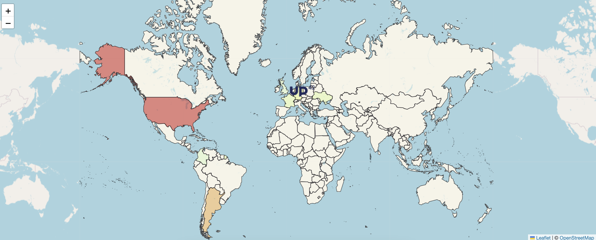

# Where Are U?

## Description
This project uses a Google sheet table and a Leaflet map to visualize a county heatmap.
The table just contains the county name and a counter (integer) for each county.
The map shows the county boundaries and its color is based on the counter value. The higher the counter, the darker the color.



## How to use
Create a Google sheet table with the following columns:

| **Country** | **Count** |
|:-----------:|:---------:|
| Germany     |         5 |
| France      |         3 |
| Argentina   |         8 |
| ...         |       ... |

ℹ️ The Google sheet table must be public (read-only). 

Copy the spreadsheet ID from the URL and paste it in the `config.js` file.
Example: 
```
https://docs.google.com/spreadsheets/d/13Hi4YNixNCvonMtT6MY9qhFr4jxx5mqB5YdYecWh5UUg
                                       ˄˄˄˄˄˄˄˄˄˄˄˄˄˄˄˄˄˄˄˄˄˄˄˄˄˄˄˄˄˄˄˄˄˄˄˄˄˄˄˄˄˄˄˄˄
                                                 this is the spreadsheet ID
```

Choose a table name (e.g. `Countries`) and paste it in the `config.js` file.


